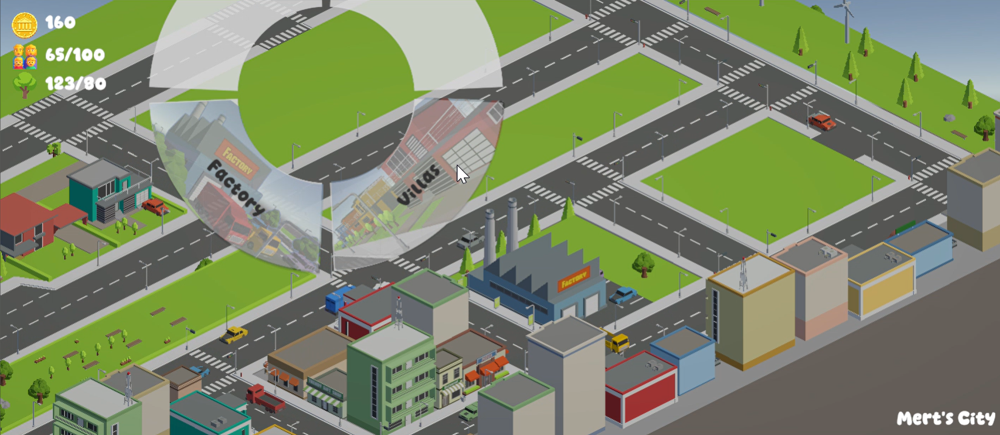
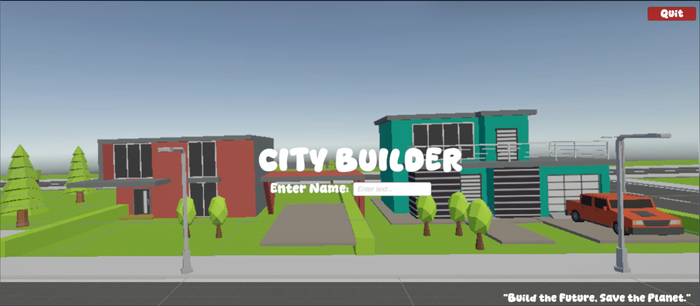
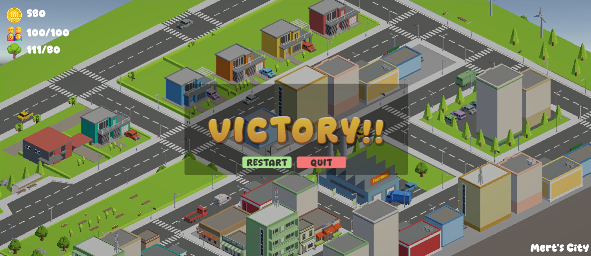

# Eco-Architect Challenge 🏙️🌱

**A Unity 3D City Builder Strategy Game**

A strategic isometric city-building game where players must balance urban expansion with environmental sustainability. Developed in Unity (C#), this project demonstrates advanced Object-Oriented Programming (OOP) principles, autonomous AI pathfinding, and modular game architecture.

---

## 🎮 Gameplay Features

* **Grid-Based Construction:** Interactive building system allowing players to place Apartments, Villas, Facories and Parks on specific plots.
* **Resource Management:** Real-time economy balancing **Money**, **Population**, and **Eco-Score**.
* **Win/Loss States:** distinct game-over conditions based on bankruptcy, overcrowding, or environmental collapse.
* **Smart Traffic AI:**
* **Auto-Discovery:** Vehicles automatically identify and assign themselves to nearby road networks.
* **Smart Parking:** A "Ticket System" algorithm ensures cars fill parking spots sequentially without collision.
* **One-Way Logic:** Autonomous navigation that handles start-to-end delivery routes.
* **Isometric Camera:** Custom controller featuring smooth panning (Lerp), screen-space dragging, and orthographic zooming.

## 🕹️ Controls

| Input | Action |
| --- | --- |
| **W, A, S, D** | Pan Camera (Movement) |
| **Right Mouse (Hold)** | Drag to Move Camera |
| **Scroll Wheel** | Zoom In / Out |
| **Left Click** | Interact / Build on Plot |

📝 Credits

* Assets: SimplyPolyCity - Low Poly Assets (Unity Asset Store/Free)
